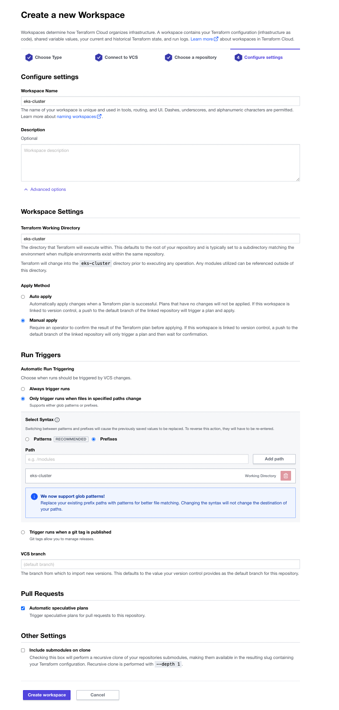

# Observability as Code with Terraform and Datadog

The code contained in this repository is based upon a a couple of Terraform tutorial and the repository of a previous "Observability as Code Webminar". You can find the links for those tutorials and repository below:

* [Provision an EKS Cluster (AWS)](https://developer.hashicorp.com/terraform/tutorials/kubernetes/eks)
* [Automate Monitoring with the Terraform Datadog Provider](https://developer.hashicorp.com/terraform/tutorials/applications/datadog-provider)
* [hashicorp/observability-as-code
  ](https://github.com/hashicorp/observability-as-code)
* [DataDog/ecommerce-workshop](https://github.com/DataDog/ecommerce-workshop/tree/main/deploy/generic-k8s/ecommerce-app)

# Prerequesites

To run this code you will need the following:

1. An AWS account to install a Kubernetes cluster (EKS)
2. A Datadog account. [Free trial](https://www.datadoghq.com/lpg/?utm_source=advertisement&utm_medium=search&utm_campaign=dg-google-brand-ww&utm_keyword=%2Bdatadog&utm_matchtype=b&utm_campaignid=9551169254&utm_adgroupid=95325237782&gclid=Cj0KCQiAg_KbBhDLARIsANx7wAw1QQwVsFWOM1np3sh340vv56wKzymC8Y75ZQaWFB2RNge2CO42y-gaAnQ7EALw_wcB) will work
3. A TFC account. Free tier will work, but we suggest you use the [free trial](https://www.hashicorp.com/blog/announcing-free-trials-for-hashicorp-terraform-cloud-paid-offerings) to check all options dicussed here.
4. Terraform 1.3.X.
   You can run this code locally simply by adding the variables to a tfvars file on your local environment
5. If you are using TFC. We need to connect your Github account to TFC as VCS provider. Details on how to do that are available in this Tutorial: [Configure GitHub.com Access through OAuth](https://developer.hashicorp.com/terraform/tutorials/cloud/github-oauth?in=terraform%2Fcloud)
6. Fork this repository

# Content

Each folder contains a few different configurations.

* **eks-cluster/**: Terraform configuration to define a three node cluster in EKS.
* **datadog-config-1/**: Terraform configuration to:
  * Deploy Datadog Agent on EKS cluster
  * Deploy eCommerce application based on Terraform Kubernetes provider (`kubernetes_manifest` resource)
  * Deploy A simple k8s deployment with a Load Balancer.
  * Create a dashboard, define some monitors and syntetic test in Datadog.
* **datadog-config-2/**: Terraform configuration to created dashboard, install monitors and apm in Datadog.
* **eCommerce_app/**: Kubernetes yaml manifest for Datadog eCommerce app. The yaml manifest have been converted into HCL by means of [tfk8s tool](https://github.com/jrhouston/tfk8s).

# Setup

We are going to create a workspace for the three folders where we have the Terraform code. The steps are the followings:

1. Log on your TFC account and create a WorkSpace by selecting the Workspace menu on the left and the the "New workspace" button on the upper-right corner

2. Create a "Version control workflow". This assume you have already defined **Github.com** as VCS provider for your TFC organization.
   * Select your VCS.
   * Then select the forked repository.
   * Change the Workspace Name to the name of the folder (i.e: eks-cluster) and the click on the "Advanced options" drop-down menu:
     * In the Terraform Working Directory set the directory name (i.e: eks-cluster).
     * Apply Method: Auto apply
     * Automatic Run Triggering: Only trigger runs when files in specified paths change (Select Syntax: Prefixes)
   * Click on "Create workspace" button.

Repeate the steps for the two directories remaining.
