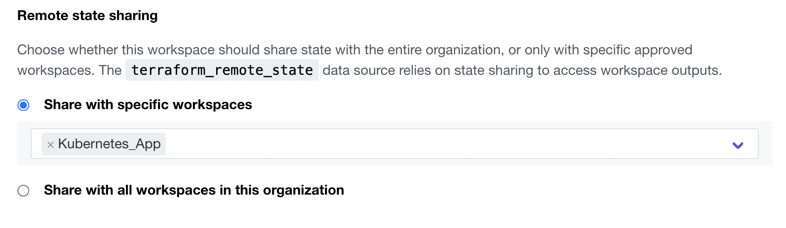
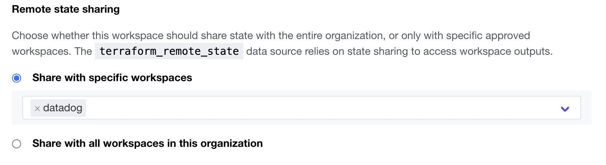
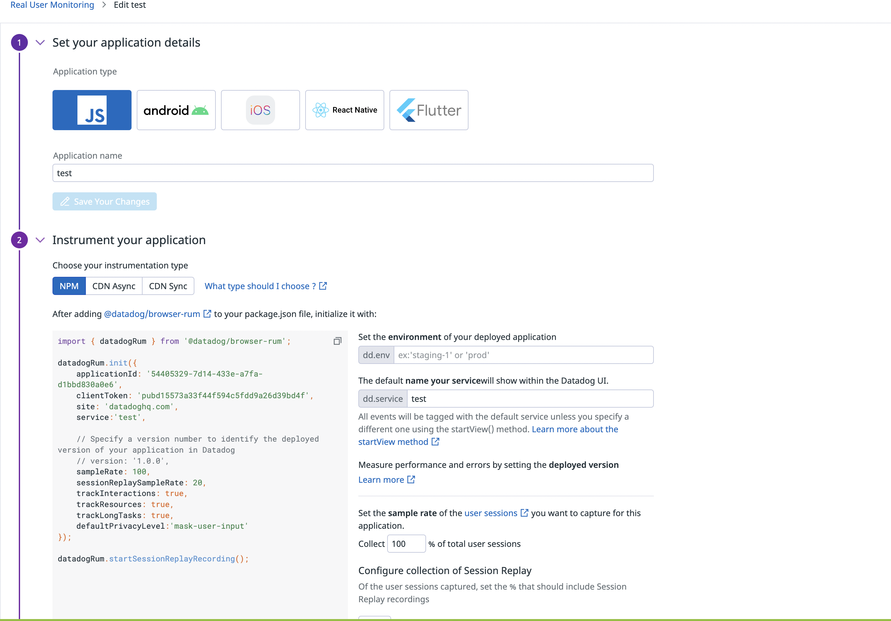
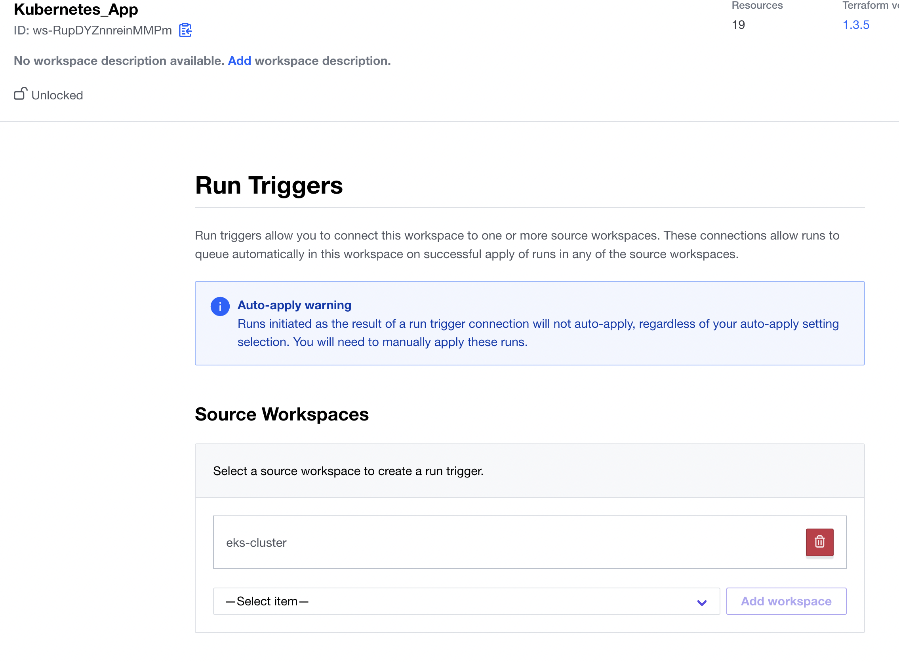
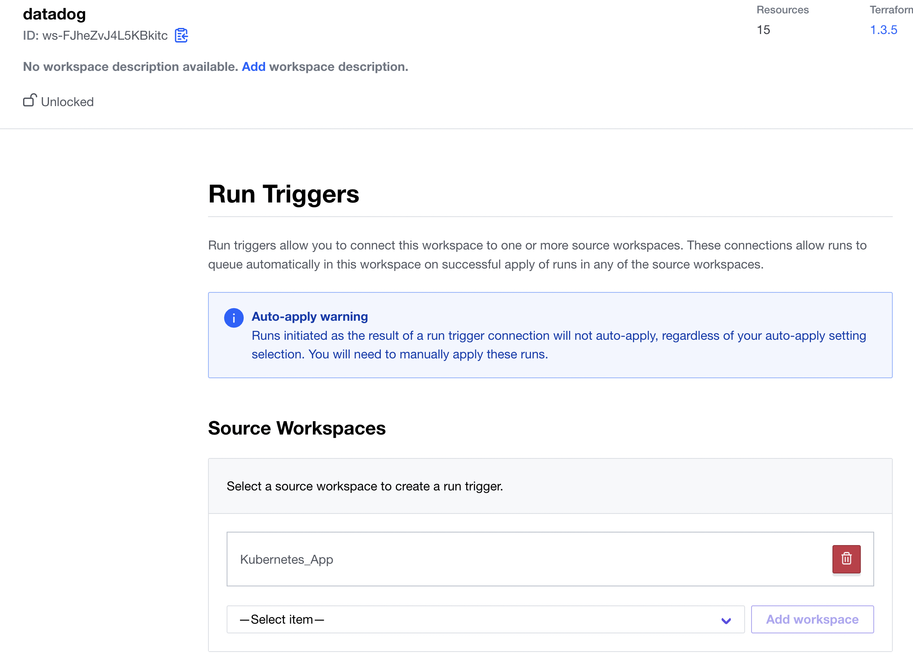
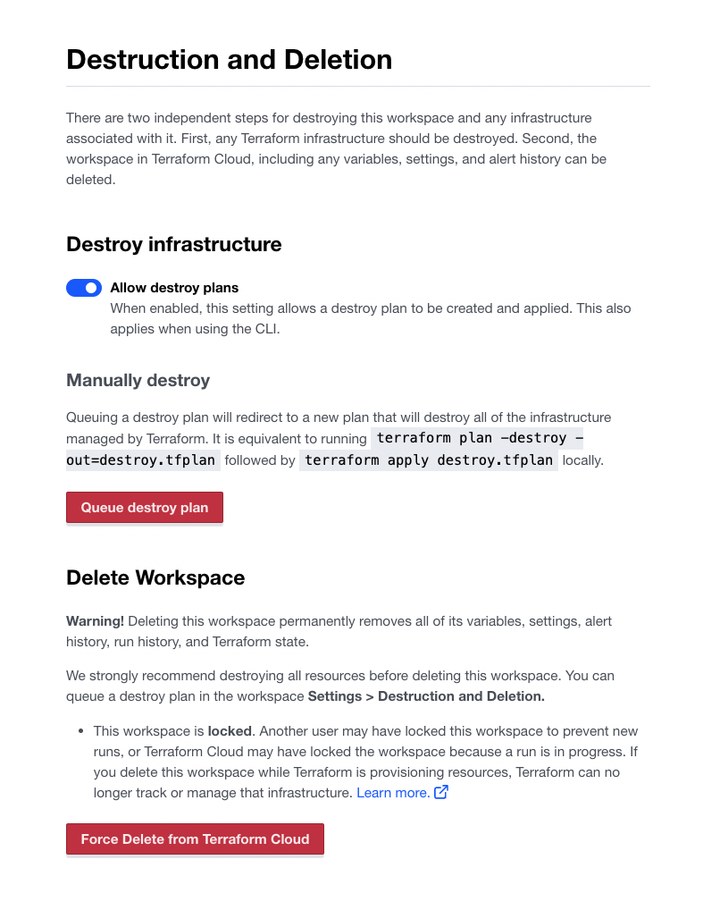

# Observability as Code with Terraform and Datadog

## Related tutorials and repositories

* [Provision an EKS Cluster (AWS)](https://developer.hashicorp.com/terraform/tutorials/kubernetes/eks)
* [Automate Monitoring with the Terraform Datadog Provider](https://developer.hashicorp.com/terraform/tutorials/applications/datadog-provider)
* [hashicorp/observability-as-code
  ](https://github.com/hashicorp/observability-as-code)
* [DataDog/ecommerce-workshop](https://github.com/DataDog/ecommerce-workshop/tree/main/deploy/generic-k8s/ecommerce-app)

## Prerequisites

To run this code you will need the following:

1. An AWS account to install a Kubernetes cluster (EKS)
2. A Datadog account. [Free trial](https://www.datadoghq.com/lpg/?utm_source=advertisement&utm_medium=search&utm_campaign=dg-google-brand-ww&utm_keyword=%2Bdatadog&utm_matchtype=b&utm_campaignid=9551169254&utm_adgroupid=95325237782&gclid=Cj0KCQiAg_KbBhDLARIsANx7wAw1QQwVsFWOM1np3sh340vv56wKzymC8Y75ZQaWFB2RNge2CO42y-gaAnQ7EALw_wcB) will work
3. A TFC account. Free tier will work, but we suggest you use the [free trial](https://www.hashicorp.com/blog/announcing-free-trials-for-hashicorp-terraform-cloud-paid-offerings) to check all options dicussed here.
4. Terraform 1.3.X.
   You can run this code locally simply by adding the variables to a tfvars file on your local environment
5. If you are using TFC. We need to connect your Github account to TFC as VCS provider. Details on how to do that are available in this Tutorial: [Configure GitHub.com Access through OAuth](https://developer.hashicorp.com/terraform/tutorials/cloud/github-oauth?in=terraform%2Fcloud)
6. Fork this repository

## Content

Each folder contains a few different configurations.

* **eks-cluster/**: Terraform configuration to define a three node cluster in EKS.
* **Kubernetes_App/**: Terraform code to:

  * Deploy Datadog Agent on EKS cluster
  * Deploy eCommerce application with Terraform.
  * Deploy a simple k8s deployment with a Load Balancer.
* **datadog/**: Terraform configuration to:

  * Create dashboards in Datadog
  * Create synthetic test in Datadog
  * Create monitors in Datadog
* **eCommerce_app/**: Kubernetes yaml manifest for Datadog eCommerce app. The yaml manifest have been converted into HCL by means of [tfk8s tool](https://github.com/jrhouston/tfk8s). Once we have migrated the manifest from yaml to HCL we have gone an step further with the frontend deployment and asociated service to use ` kubernetes_deployment` and `kubernetes_service` resources.

## Setup

We are going to create a workspace for the three folders where we have the Terraform code. The steps are the followings:

1. Log on your TFC account and create a WorkSpace by selecting the Workspace menu on the left and the the "New workspace" button on the upper-right corner

2. Create a "Version control workflow". This assume you have already defined **Github.com** as VCS provider for your TFC organization.
   * Select your VCS.
   * Then select the forked repository.
   * Change the Workspace Name to the name of the folder (i.e: eks-cluster) and the click on the "Advanced options" drop-down menu:
     * In the Terraform Working Directory set the directory name (i.e: **eks-cluster/**).
     * Apply Method: Auto apply
     * Automatic Run Triggering: Only trigger runs when files in specified paths change (Select Syntax: Prefixes)
   * Click on "Create workspace" button.

Repeate the steps for **Kubernetes_App/** and **datadog/** directories.

The code in the **Kubernetes_App workspace** makes use of a **remote-state-backend** to read the state of the **eks-cluster** workspace. For that reason we need to provide access to datadog workspace to eks-cluster workspace. To do so, select the eks-cluster workspace and then select Settings on the left panel, which will take you to the General Setings page. Look for **Remote state sharing** and select the "Share with specific workspaces" radio button, and then in the space below select the datadog workspace.

The same applies for the datadog workspace, which uses the remote state data from the Kubernetes_App workspace, and so it must be given access, from within the Kubernetes_App workspace (Workspace Settings > General)

## Variables.

The following variables must be set per Workspace:

### eks-cluster

* aws_region (terraform): the AWS region (ie: us-east-1)
* vpc_name (terraform): name for the vpc and Kubernetes cluster
* AWS_ACCESS_KEY_ID (env): AWS access key.
* AWS_SECRET_ACCESS_KEY (env): AWS secret key (set as sensitive)
* [Optional] AWS_SESSION_TOKEN (env): AWS session token (set as sensitive)

### Kubernetes_App

* aws_region (terraform): the AWS region (ie: us-east-1). Use the same as **eks-cluster** workspace.
* application_name (terraform): name for the simple K8s deployment.
* org_name: name of your TFC organization, where the **eks-cluster** workspace has been deployed.
* AWS_ACCESS_KEY_ID (env): AWS access key.
* AWS_SECRET_ACCESS_KEY (env): AWS secret key (set as sensitive)
* [Optional] AWS_SESSION_TOKEN (env): AWS session token (set as sensitive)
* datadog_api_key (terraform): Datadog API Key (set as sensitive)
* datadog_app_key (terraform): Datadog API Key (set as sensitive)
* DD_CLIENT_TOKEN: RUM client Token
* DD_APPLICATION_ID: RUM application Token

> Example showing how to instrument application for RUM functionality

### Datadog

* aws_region (terraform): the AWS region (ie: us-east-1). Use the same as **eks-cluster** workspace.
* application_name (terraform): name for the simple K8s deployment.
* org_name: name of your TFC organization, where the **eks-cluster** workspace has been deployed.
* AWS_ACCESS_KEY_ID (env): AWS access key.
* AWS_SECRET_ACCESS_KEY (env): AWS secret key (set as sensitive)
* [Optional] AWS_SESSION_TOKEN (env): AWS session token (set as sensitive)
* datadog_api_key (terraform): Datadog API Key (set as sensitive)
* datadog_app_key (terraform): Datadog API Key (set as sensitive)
* DD_CLIENT_TOKEN: RUM client Token
* DD_APPLICATION_ID: RUM application Token
* DD_CLIENT_ID: RUM client ID

> Variable shared among workspaces can be defined as "Variable sets" and then associated to specific workspaces. This has two benefits:

> * We can split the scope of what different persons within the organization can do (ie: we can create a role to define the datadog keys, who can associate those sensitive variables to a workspace; this way the platform team creating the Terraform code does not have to see those keys).
> * And follow DRY principle.

## Bonus

If you want you can automate the execution of the workspaces datadog by means of Run Triggers. To that end you need to be using TFCB. To that end select any of these workspaces and go to Settings > Run Triggers and select eks-cluster as "Source Workspaces" for "Kubernetes_APP" and select "Kubernetes_App" as "Source Workspaces" for "datadog".

###### eks-cluster as "Source Workspace" for Kubernetes_App

###### Kubernetes_App as "Source Workspace" for datadog

## Implementation.

Once you have completed the set up, start by creating a **run** (Plan + Apply) of **eks-cluster workspace**. Once completed you should generate another **run** for **Kubernetes_APP** and finally for **datadog** workspaces  (not needed if using Run Triggers).

## Clean-up

Start by destroying the **datadog** workspace, followed by **Kubernetes_APP** and once completed finish with the **eks-cluster** workspace.

To delete the state, select the Workspace, on the left click on Settings > Destruction and Deletion. On the new page click on "Queue destroy plan"

