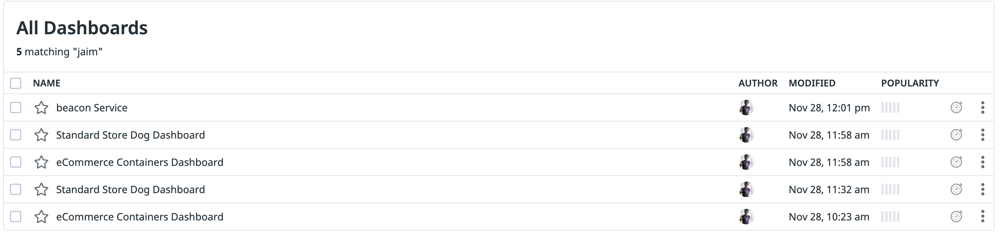
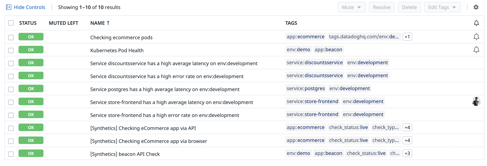
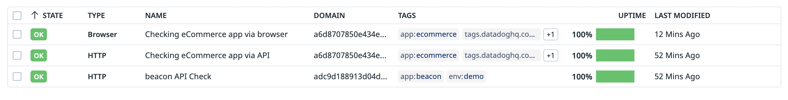

# Deploying Dashboards, Monitors and Synthetic Test in Datadog

We have taken some examples from the original "[observability as code webminar]()(https://github.com/hashicorp/observability-as-code)" and extended it with more monitors, synthetic tests and dashboards.

If you want to run this code locally update the terraform.tf file with the following

Instead of this

```bash
data "terraform_remote_state" "k8s" {
  backend = "remote"

  config = {
    organization = var.org_name
    workspaces = {
      name = "Kubernetes_App"
    }
  }
}
```

Use this

```bash
data "terraform_remote_state" "k8s" {
  backend = "local"

  config = {
    path = "../Kubernetes_App/terraform.tfstate"
  }
}
```

and remove the `org_name` variable from the `variables.tf`

You can define the rest of the variables using a **tfvars** file

---

Results in Datadog

1. Dashboards



2. Monitors



3. Synthetic Tests


